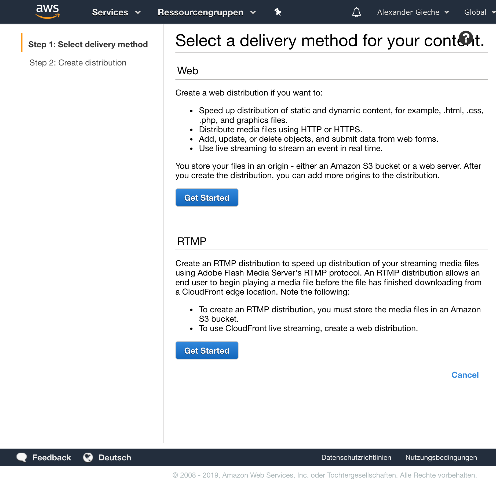
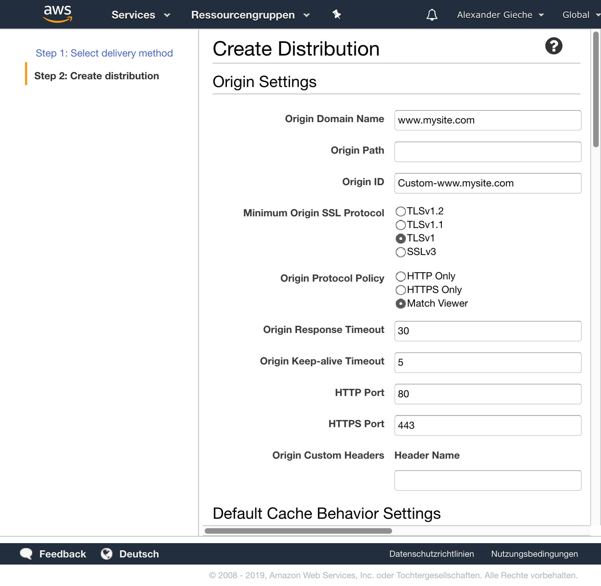

**THIS ARTICLE IS STILL IN THE MAKING**

This article will teach you, how to increase your rails apps performance by delivering assets
like static images, scripts and stylesheets from a CDN (AWS Cloudfront).

**Prerequisites**
- A Ruby on Rails application, that can be deployed to a live environment
- Known IP Address or custom domain for your rails application
- Amazon AWS account

This step-by-step tutorial also assumes, that you're using the rails asset pipeline for your assets. However, the important part here: Your assets should have a unique fingerprint within the filename, so that cloudfront cache will update its content after a change in your assets.

---------------------

## Speed is a king

The message at Google I/O 19 was loud and clear. __Speed is king.__ Especially in emerging markets and a growing mobile user base, performance is a key factor for a pleasant user experience. The likeliness of a successful interaction or conversion within your product decreases with every second, a user is waiting for your web page rendering.

A big chunk of web performance is tightly coupled to **delivery and optimization of assets**, like images, scripts and stylesheets. 

So, if you could only make one improvement for your applications performance, you might want to speed up and optimize your asset delivery, since the potential performance gain is quite large in comparison to a small to moderate amount of coding time.

> If you could do only one performance improvement for your app: Optimize your assets and their delivery.

A quick win to improve performance:  Use a content delivery network instead of delivering your assets from your application server or from a slow file storage like S3.

---------------------

## Advantages of Amazon CloudFront CDN

A content delivery network (CDN) like Amazon Cloudfront offers several benefits for your application:

- **Performance** (low latency, global distribution of your content / caching)
- **Availability** (even during traffic spikes)
- **Security** (protection from DDoS and other kind of attacks)
- **Economical** (costs only for transferred data)

### How CloudFront works

The short version of how CloudFront works is displayed in the following image:

[Image source](https://docs.aws.amazon.com/AmazonCloudFront/latest/DeveloperGuide/HowCloudFrontWorks.html)

1.  When a user is requesting an image from your rails app, the rails app will point to a cloudfront URL.
2. The DNS is redirecting to the nearest **Edge Location* to keep latency low.
3. If the image is already available at the edge location, the image gets returned.
4. If the image is not available, the Edge location will retreive the image from an origin server, e.g. your rails application and serve it from cache for all following requests.

More info on this topic can be found [here](https://docs.aws.amazon.com/de_de/AmazonCloudFront/latest/DeveloperGuide/HowCloudFrontWorks.html).

--------------------------

## Switching to CloudFront

### Create an AWS account

TBD

### Create a new cloudfront distribution

After creating your account, you should select the CloudFront control panel and click `Create distribution` and choose `Web` as delivery method.

This is hoq you might configure your distribution afterwards. Regarding the origin for your distribution, s enter the domain name or IP Address of your application. If your app is completely SSL, you might also check HTTPS only under Origin Protocol Policy.

So after creating the distribution, it'll take a couple of minutes, until everything is up and running.

### Multiple Origins and behaviours (optional)
TBD

### Test if cloudfront is fetching assets
TBD

### Update config in rails
TBD

### Deploy your application
TBD

--------------------------

## Fix cross origin problems with rack-cors gem

TBD

--------------------------

## Speed gains / How do we get http2 to work / Enforce http2 protocol with edge addon?

TBD

More info: https://www.mixable.net/blog/making-heroku-fast/

--------------------------

## Bonus tipp: Image optimization with squoosh.app

TBD

--------------------------

## Conclusion

TBD

Sources:
https://medium.com/@tranduchanh.ms/optimize-rails-app-performance-with-rails-amazon-cloudfront-e3b305f1e86c
https://www.happybearsoftware.com/use-cloudfront-and-the-rails-asset-pipeline-to-speed-up-your-app.html
https://www.mixable.net/blog/making-heroku-fast/
