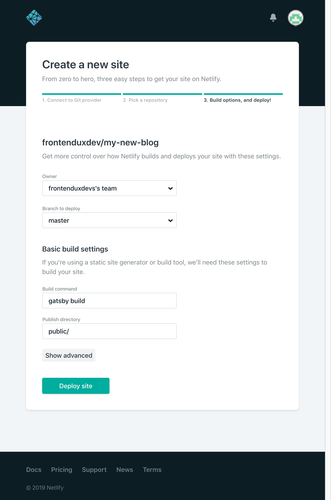

I wanted to start a blog about frontend related topics for a long time now. Due to the inspiration
at [Google I/O 19](https://events.google.com/io/), I started to setup my blog this evening. Since I read a lot of good feedback about it, I 
wanted to build this blog with a static site generator called [gatsby.js](https://www.gatsbyjs.org/). I only have experience with rails and wordpress, when it comes serving a blog - so this is a complete new stack for me. YAY! 😻 Let's dive in.

## Gatsby FTW


I decided to give **gatsby** a spin. Here are some key technical facts about gatsby:

- static site generator
- React-based
- GraphQL powered (collect your data from everywhere: Markdown, JSON, Headless CMS, APIs etc.)
- webpack and react-router working in the background
- PWA ready

Furthermore, gatsby offers:
- an easy **setup**
- nice **documentation** for beginners
- **joy** for the developers using it
- plenty of great [examples](https://www.gatsbyjs.org/showcase/), e.g. [reactjs.org](https://reactjs.org/) is built with gatsby
- cheap or free **hosting possibilities** (e.g. netlify), since gatsby simply exports static sites (well, you could host it directly on S3 if you want)
- speed! gatbsy is **blazing fast** out of the box.

I found several great introductions on how to [setup a gatsby blog](https://daveceddia.com/start-blog-gatsby-netlify/) in general, but since developers also need some plugins for code highlighting, I decided to write my own setup article.

-----------------

## How to run gatsby locally

Ok, lets get our hands dirty! First of all, you need the following **prerequisites** to run gatsby locally:

- Text Editor
- Web Browser
- Node + NPM or Yarn

**Install CLI**
```shell
yarn global add gatsby-cli
# or
npm install -g gatsby-cli

```

**Create a new site from the gatsby blog template**
For your first blog, you should really try the gatsby starter blog template by [@kylemathews](https://twitter.com/kylemathews). It is a nice preconfigured blog template, that will work out of the box. Here is, how you install the starter template:
```shell
gatsby new my-frontend-blog https://github.com/gatsbyjs/gatsby-starter-blog
```

**Start developing**
Now, we can start the dev server and have a first look on our new blog:

```shell
cd my-frontend-blog
gatsby develop
```

**Open browser to access dev server**

```
http://localhost:8000/
```

If everything went smoot, you should see something like this:


Nice job! This is easy, right? Just follow along and learn how to adjust your content.

-----------------

## Your first article with markdown

Gatsby is GraphQL-powered and therefore very flexible when it comes to data sources. One easy way to insert data into your blog is by writing markdown files. 

Lets take a look at the hello world article, that comes with our starter blog template.


This article (when using the blog starter pack) is editable under `./content/blog/hello-world/index.md` and the markup looks like this:


```markdown
// content/blog/hello_world/index.md
---
title: Hello World
date: "2015-05-01T22:12:03.284Z"
---

This is my first post on my new fake blog! How exciting!

I'm sure I'll write a lot more interesting things in the future.

Oh, and here's a great quote from this Wikipedia on
[salted duck eggs](http://en.wikipedia.org/wiki/Salted_duck_egg).

> A salted duck egg is a Chinese preserved food product made by soaking duck
> eggs in brine, or packing each egg in damp, salted charcoal. In Asian
> supermarkets, these eggs are sometimes sold covered in a thick layer of salted
> charcoal paste. The eggs may also be sold with the salted paste removed,
> wrapped in plastic, and vacuum packed. From the salt curing process, the
> salted duck eggs have a briny aroma, a gelatin-like egg white and a
> firm-textured, round yolk that is bright orange-red in color.


```


### Adding new articles

You can add new directories (with an index.md) to the `content`-directory  to add new articles. Gatsby will figure out, that there is a new article and will display it on the homepage article listing.

### Markdown syntax
If you\'re not familiar with Markdown yet, have a look at the [Markdown GitHub Guide](https://guides.github.com/features/mastering-markdown/).


-----------------


## Adjust styling

The default layout, that is provided from the starter template is clean, but you may want to give it a little twist in the future to make your blog stand out a little. To add a globally available page styling, you may add a layout.css file.


```css
/* src/components/layout.css */

/* just an example for a global style declaration */
html {
  box-sizing: border-box;
}

*, ::before, ::after {
  box-sizing: inherit;
}
```

Then, include the layout.css within your layout component.

```js
// src/components/layout.js
import React from "react"
import { Link } from "gatsby"
// highlight-next-line
import "./layout.css"

class Layout extends React.Component {
    // snipped for brevity
}
```


Finished! Now, your global styling should be included by your layout component. Since the layout component is present on every route, the style is loaded everywhere. Now, we're getting to the dev-specific part of this gatsby setup. In the next chapters, you will learn about syntax and code highlighting, add ing support for linenumber display and line highlighting. Let's move!

-----------------

## Code Highlighting with Gatsby Plugins
To make code examples easier to grasp, syntax highlighting is a nice addition when using a `<pre>`. 

We will use a plugin called gatsby-remark-prismjs to accomplish code highlighting in gatsby:

```shell
npm install --save gatsby-transformer-remark gatsby-remark-prismjs prismjs
```

Add the gatsby-transformer-remark config object to the plugins array in your gatsby-config.js:
```js
// In your gatsby-config.js
plugins: [
  {
    resolve: `gatsby-transformer-remark`,
    options: {
      plugins: [
        {
          resolve: `gatsby-remark-prismjs`,
          options: {
            // Class prefix for <pre> tags containing syntax highlighting;
            // defaults to 'language-' (eg <pre class="language-js">).
            // If your site loads Prism into the browser at runtime,
            // (eg for use with libraries like react-live),
            // you may use this to prevent Prism from re-processing syntax.
            // This is an uncommon use-case though;
            // If you're unsure, it's best to use the default value.
            classPrefix: "language-",
            // This is used to allow setting a language for inline code
            // (i.e. single backticks) by creating a separator.
            // This separator is a string and will do no white-space
            // stripping.
            // A suggested value for English speakers is the non-ascii
            // character '›'.
            inlineCodeMarker: null,
            // This lets you set up language aliases.  For example,
            // setting this to '{ sh: "bash" }' will let you use
            // the language "sh" which will highlight using the
            // bash highlighter.
            aliases: {},
            // This toggles the display of line numbers globally alongside the code.
            // To use it, add the following line in src/layouts/index.js
            // right after importing the prism color scheme:
            //  `require("prismjs/plugins/line-numbers/prism-line-numbers.css");`
            // Defaults to false.
            // If you wish to only show line numbers on certain code blocks,
            // leave false and use the {numberLines: true} syntax below
            showLineNumbers: false,
            // If setting this to true, the parser won't handle and highlight inline
            // code used in markdown i.e. single backtick code like `this`.
            noInlineHighlight: false,
          },
        },
      ],
    },
  },
]
```

If you're a developer like me, you won't stick with the default theme and have a look at the other available themes [here](https://github.com/PrismJS/prism/tree/master/themes). Just add the corresponding styling in your gatsby-browser.js like this to view the theme.

```js{numberLines: true}
// gatsby-browser.js
require("prismjs/themes/prism-tomorrow.css");
```

Now, you should insert your first code example block into your article like this::
```markdown
// content/blog/hello_world.md

```js
stop().then(() => {
  console.log('hammer time!')
});
```                                                                     `

```

and it will be displayed as:

```js
stop().then(() => {
  console.log('hammer time!')
});
```

That's neat. If you need a short break, just listen to [this on spotify](https://open.spotify.com/track/1B75hgRqe7A4fwee3g3Wmu) and come back, when you're finished. In the next chapter, we will tweak code highlighting a little more.


-----------------

## Enable line numbers and line-highlighting

To make your code examples even better to understand, you can add support for **line numbers** and highlighting of specific line(s). Here's how you do it. First, add the corresponding styling in your browser file.

```js
//gatsby-browser.js
require("prismjs/plugins/line-numbers/prism-line-numbers.css")
```

Now you need to add some more custom styles to make prism styles work with gatsby:

```css
/*layout.css*/

/* code highlighting */
.gatsby-highlight-code-line {
  background-color: #4d4d4d; /* Adjust for your prismjs theme color */
  display: block;
  margin-right: -1em;
  margin-left: -1em;
  padding-right: 1em;
  padding-left: 0.75em;
  border-left: 0.25em solid #f99;
}

/* Make the highlightline start at the beginning of the line,
when line numbers are displayed */
.line-numbers .gatsby-highlight-code-line {
  margin-left: -3.8em;
  padding-left: 3.55em;
}

/**
 * Add back the container background-color, border-radius, padding, margin
 * and overflow that we removed from <pre>.
 */
 .gatsby-highlight {
  background-color: #2d2d2d; /* Use your prismjs theme color */
  border-radius: 0.3em;
  margin: 0;
  margin-bottom: 2.5rem;
  padding: 1em;
  overflow: auto;
}

/**
 * Remove the default PrismJS theme background-color, border-radius, margin,
 * padding and overflow.
 * 1. Make the element just wide enough to fit its content.
 * 2. Always fill the visible space in .gatsby-highlight.
 * 3. Adjust the position of the line numbers
 */
.gatsby-highlight pre[class*="language-"] {
  background-color: transparent;
  margin: 0;
  padding: 0;
  overflow: initial;
  float: left; /* 1 */
  min-width: 100%; /* 2 */
}


/**
 * If you only want to use line numbering
 */
.gatsby-highlight pre[class*="language-"].line-numbers {
  padding: 0;
  padding-left: 2.8em;
  overflow: initial;
}
```

Ok, lets try it out:

```markdown


`````js{numberLines: true}
console.log('line1');
console.log('line2');
console.log('line3');
```                                                                                      `

```

is now displayed as:

```js{numberLines: true}
console.log('line1');
console.log('line2');
console.log('line3');
```

Isn't this a nice touch for your new devblog? 🎉 So that\'s it about code highlighting.
If you want to know more about code and syntax highlighting, go see [gatsby-remark-prismjs](https://www.gatsbyjs.org/packages/gatsby-remark-prismjs/) and [using-remark.gatsbyjs.org](https://using-remark.gatsbyjs.org/code-and-syntax-highlighting).

-----------------

## Add google analytics to your blog

Now to something completely different: TRACKING. If you're like me, you may want to have some insights on, how often your blog is visited and by whom. Luckily, Google Analytics is very easy to integrate in gatsby.

Prerequisites:

- Google Analytics Account

Install the google analytics gatsby plugin:

```shell
npm install --save gatsby-plugin-google-analytics
# or
yarn add gatsby-plugin-google-analytics
```

After installing, just add the config object to your plugins array. This might feel familiar from setting up code highlighting earlier:
```js

// gatsby-config.js
module.exports = {
  plugins: [
    {
      resolve: `gatsby-plugin-google-analytics`,
      options: {
        trackingId: "YOUR_GOOGLE_ANALYTICS_TRACKING_ID"
      },
    },
  ],
}

```

After setting this up, Make sure to insert your google analytics tracking ID into the config ( looks similar to this: `UA-123456789-1`). 

For more info about the plugin, visit the [plugin page](https://www.gatsbyjs.org/packages/gatsby-plugin-google-analytics/).

-----------------

## Add a comment form below your article

One easy way to enable comments for your content is **disqus**.  More info [here](https://disqus.com/).

Install the disqus plugin for gatsby:

```shell
npm install -S gatsby-plugin-disqus
# or
yarn add gatsby-plugin-disqus
```

Adjust your config file and insert your disqus short name there. In case, you don't have a disqus account, register [here](https://disqus.com/).

```js
// gatsby-config.js
module.exports = {
  plugins: [
    {
      resolve: `gatsby-plugin-disqus`,
      options: {
        shortname: `your-disqus-shortname`
      }
    },
  ]
}
```

Now, you can add the Disqus Component to your article template.

```js
// src/templates/blog-post
import Disqus from 'gatsby-plugin-disqus'

class BlogPostTemplate extends React.Component {
  render() {
    const post = this.props.data.markdownRemark

    return (
      <Layout>
        /* post snipped for brevity */
        <Disqus 
          identifier={post.id}
          title={post.frontmatter.title}
        />
      </Layout>
    )
  }
}

```

Now, there should be a comment form below your post similar to this one below.


We're getting there!  🎉 Our local setup is complete-ish and we can move on to deploying your new blog. Read more in the next chapter.

---------------------

## Deploy your blog to netlify

Now, it's getting serious. Lets deploy your new blog to netlify, an excellent host for static pages just like your new shiny blog.

### Push your code to github

First, you need to create a repo on github [https://github.com/new](https://github.com/new) for your blog, since we will connect the repo with netlify. This will enable netlify, to deploy a new version of your site right after each push to your repo.

After you created a repo on github, you should connect your local version of your blog source code with the remote github repo as described in the success page 

```shell
# create a new local git repo via commandline
# replace
echo "# my-new-blog" >> README.md
git init
git add README.md
git commit -m "first commit"
git remote add origin git@github.com:YOU_GITHUB_ACCOUNT_NAME/YOUR_REPO_NAME.git
git push -u origin master
```

```shell
# or push your existing repo to github
git remote add origin git@github.com:YOUR_GITHUB_ACCOUNT_NAME/YOUR_REPO_NAME.git
git push -u origin master
```

### Setup netlify

1. Register a new netlify account here: [https://app.netlify.com/signup](https://app.netlify.com/signup)

2. After registration, connect your github repo to netlify here: [https://app.netlify.com/start](https://app.netlify.com/start)

### Connection netlify to github

#### Step 1 (https://app.netlify.com/start)


#### Step 2 (Pick a repository)


#### Step 3 (Site deploy settings)


After successful connection, a deployment should have been triggered and your site should be live on netlify. 🎉


### Other hosts

**Create a static version of your blog**

Since gatsby is a static site generator, all of your code and content is translated into static html, js and css, which can be served even on simple hosting providers. If you want to create a new version of your blog, that you can copy to your hosting provider, you simply run:

```shell
gatsby build
```

After the build is finished, the `./public` directory should be populated with your updated blog site including all html, images, js and css. From there, you can also manually copy the files to your static hosting service. But I really recommend going with netlify, especially for beginners.


---------------------

## Conclusion

So, you reached the end of this article. YAY! If everything went well, your blog is now live at netlify and you covered the basic parts of a gatsby blog for developers. I hope, you enjoyed the setup as much as I during the setup of frontendux.dev.

I have spent several days now with setting up my blog in my free time using gatsby and netlify. First of all: **it was fun** to experience a new stack powered by react! I discovered many great tutorials and setup guides during setup, that really helped me getting along. As far as I can judge by now, the community (and also the docs) behind gatsby is really nice and active!

**Mandatory happy capybara pic:**
<div style="width:100%;height:0;padding-bottom:56%;position:relative;"><iframe src="https://giphy.com/embed/Q7fa42S3mYLaU" width="100%" height="100%" style="position:absolute" frameBorder="0" class="giphy-embed" allowFullScreen></iframe></div><p><a href="https://giphy.com/gifs/capybara-Q7fa42S3mYLaU">via GIPHY</a></p>

I really liked the idea of the  blog starter template, that gave me a nice and complete starting point. From there, I've could peek into into the different parts of gatsby without the need to understand everything instantly. It just worked and was ready for small adjustments. So I could really tackle one issue a time without getting overwhelmed or frustrated.

So, Gatsby hosted on netlify is a winning combination in my opinion. Local development with gatsby is fast and pretty reliable. What you see in development exactly matches the deployed state on your netlify production environment.

What really impresses me is the performance, that you'll get out of the box with gatsby. Even after adding a somehow heavy logo animation and several images to my article, the speed is quite impressive according to a lighthouse audit:


Now it's time to start writing articles and keep learning about #JAMstack, gatsby and blogging in general. Happy coding!

## You're also running a gatsby blog?

If yes, please leave a comment with a link to your blog. I'm very curious to see other blogs! I am also very happy about your feedback and hints.
